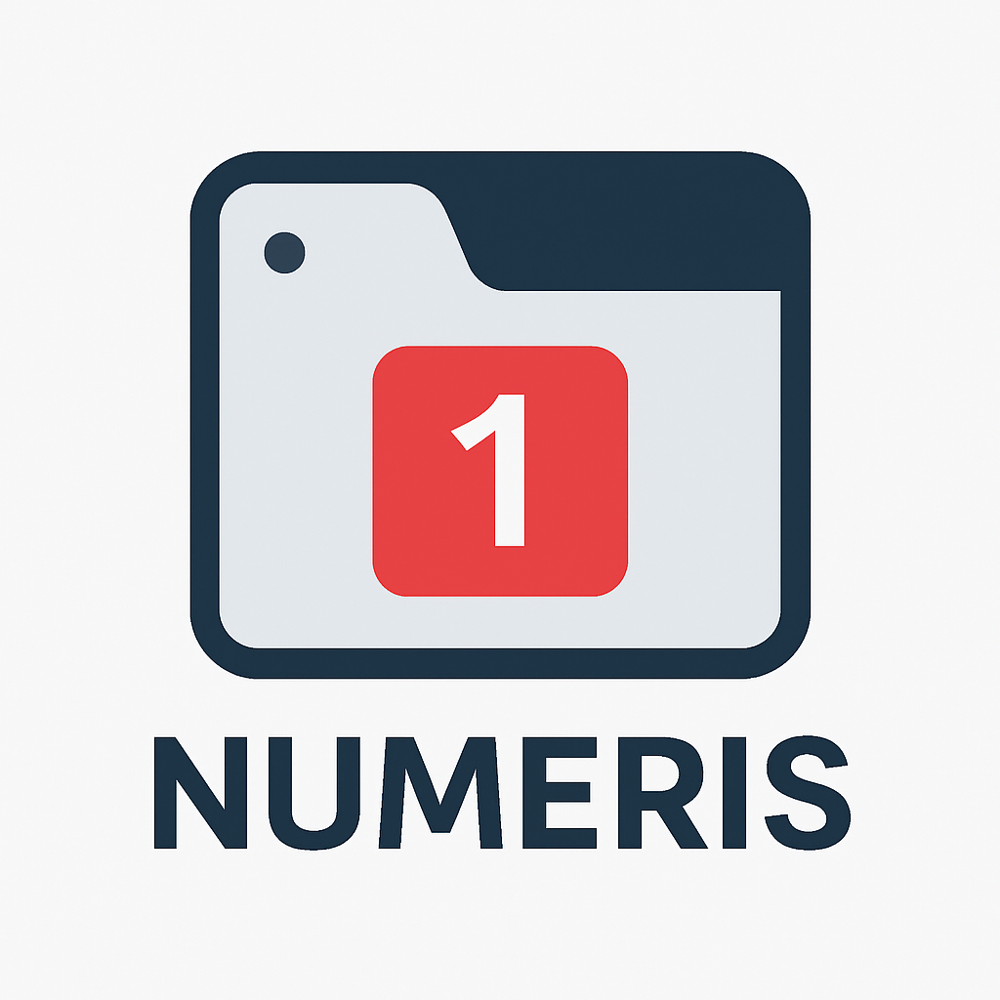

# [n]umeris – Visual Tab Numbers for Fast Switching 🚀



### 🧠 “Why guess, when you can see?”

**[n]umeris** is a lightweight, blazing-fast Chrome Extension that displays tab numbers directly in your tab titles like:  
`[1] Gmail`, `[2] YouTube`, `[3] Stack Overflow`...

So now, instead of counting manually, you can just *look* and press `Ctrl + [n]` to jump directly to the tab you want.

---

## ⚙️ Features

✅ Auto-prefixes each tab with a number based on its position  
✅ Works instantly across all tabs (except system/extension pages)  
✅ Real-time update when tabs are opened, moved, or closed  
✅ Boosts productivity with visual cues  
✅ Clean, unobtrusive design  
✅ Keyboard-friendly navigation  

---

## 🌟 Demo

  
_Quickly jump to any tab by pressing Ctrl + [1-8]_

---

## 🧩 Installation (Development Mode)

1. **Download or Clone** this repository:
   ```bash
   git clone https://github.com/your-username/numeris.git
   cd numeris
   ```

2. Open Chrome and go to:  
   `chrome://extensions/`

3. Enable **Developer Mode** (top right)

4. Click **“Load unpacked”** and select this `numeris` folder

5. Done! You’ll now see numbers like `[1]`, `[2]` in your tab titles 🧠

---

## 🧬 How It Works

- A background service worker listens for tab events (`onCreated`, `onMoved`, `onActivated`, etc.)
- On change, it re-numbers all tabs and injects a content script into each tab.
- The content script modifies the page title to prepend the number `[n]`.

---

## 🛠 Project Structure

```
numeris/
├── manifest.json            # Chrome extension config
├── background.js            # Service worker logic
├── tabNumberUpdater.js      # Content script to change tab title
├── logo.png                 # Extension logo
└── README.md                # You're here :)
```

---

## 🧠 Why the Name "[n]umeris"?

> Latin for “numbers” – but with a little twist:  
> The square-bracket `[n]` styling is exactly how the extension works!  
> So it’s both a function and a name. Clean, nerdy, and effective.

---

## 🧰 Tech Used

- JavaScript (Vanilla)
- Chrome Extensions API
- Chrome Tabs API
- Manifest V3

---

## 🧑‍💻 Author

**Shadab Ahmad**  
🕸 Full-stack Web Developer | JavaScript Lover  
📫 [Connect on LinkedIn](https://www.linkedin.com/in/ahmadshadab/)  
💬 Drop a ⭐ if this helped you speed up your browsing!

---

## 📃 License

MIT License – Use freely, modify generously, attribute kindly.

---

## 💡 Future Features (Planned)

- [ ] Toggle `[n]` display on/off
- [ ] Custom number format `(1)` / `#1` / `1.`
- [ ] Dark/light theme badge styling
- [ ] Exclude specific websites via options page

---

> ✨ Let's stop wasting time counting tabs — just [n]umeris it!
